# canvas

## canvas简介

`<canvas>` 是 `HTML5` 新增的，一个可以使用脚本(通常为 `JavaScript`) 在其中绘制图像的 `HTML` 元素。它可以用来制作照片集或者制作简单的动画，甚至可以进行实时视频处理和渲染。

## 基本使用

### `<canvas>`元素

`<canvas>`只有两个可选属性，`height`，`widht`，如果不给`<canvas>`设置属性，默认`widht`为300，`height`为150，单位都是 `px`。也可以使用 `css` 属性来设置宽高，但是如宽高属性和初始比例不一致，`<canvas>`会出现扭曲。所以，建议永远不要使用 `css` 属性来设置 `<canvas>` 的宽高。

**替换内容**

由于某些较老的浏览器（尤其是 IE9 之前的 IE 浏览器）或者浏览器不支持 HTML 元素 `<canvas>`，在这些浏览器上你应该总是能展示替代内容。

支持 `<canvas>` 的浏览器会只渲染 `<canvas>` 标签，而忽略其中的替代内容。不支持 `<canvas>` 的浏览器则 会直接渲染替代内容。

用文本替换：

```html
<canvas>
    你的浏览器不支持 canvas，请升级你的浏览器。
</canvas>
```

用 `` 替换：

```html
<canvas>
     
</canvas>
```

结束标签 `</canvas>` 不可省略。

与 `` 元素不同，`<canvas>` 元素需要结束标签(`</canvas>`)。如果结束标签不存在，则文档的其余部分会被认为是替代内容，将不会显示出来。

### 渲染上下文(Thre Rending Context)

`<canvas>` 会创建一个固定大小的画布，会公开一个或多个**渲染上下文**(画笔)，使用**渲染上下文**来绘制和处理要展示的内容。

```javascript
let canvas = document.getElementById('tutorial');
//获得 2d 上下文对象
let ctx = canvas.getContext('2d');
```

### 检测支持性

```javascript
let canvas = document.getElementById('tutorial');

if (canvas.getContext){
  let ctx = canvas.getContext('2d');
  // drawing code here
} else {
  // canvas-unsupported code here
}
```

### 代码模板

```html
<canvas id="test" width="300" height="300"></canvas>
```

```javascript
function draw(){
    let canvas = document.getElementById('test');
    if(!canvas.getContext) return;
      var ctx = canvas.getContext("2d");
      //开始代码    
}
draw()
```

## 绘制形状

### 栅格（grid）和坐标空间

`canvas` 元素默认被网格所覆盖。通常来说网格中的一个单元相当于 `canvas` 元素中的一像素。栅格的起点为左上角，坐标为 (0,0) 。所有元素的位置都相对于原点来定位。所以图中蓝色方形左上角的坐标为距离左边（X 轴）x 像素，距离上边（Y 轴）y 像素，坐标为 (x,y)。


### 绘制矩形

`<canvas>` 只支持一种原生的图形绘制：**矩形**。所有其他图形都至少需要生成一种路径 (`path`)。

`canvas`提供了三种方法绘制矩形：

- 1、`fillRect(x, y, width, height)`：绘制一个填充的矩形。
- 2、`strokeRect(x, y, width, height)`：绘制一个矩形的边框。
- 3、`clearRect(x, y, width, height)`：清除指定的矩形区域，然后这块区域会变的完全透明。

**说明：**

这 3 个方法具有相同的参数。

- **x, y**：指的是矩形的左上角的坐标。(相对于canvas的坐标原点)
- **width, height**：指的是绘制的矩形的宽和高。

```javascript
function draw(){
    let canvas = document.getElementById('test');
    if(!canvas.getContext) return;
    let ctx = canvas.getContext("2d");
    ctx.fillRect(10, 10, 100, 50);     // 绘制矩形，填充的默认颜色为黑色
    ctx.strokeRect(10, 70, 100, 50);   // 绘制矩形边框
    
}
draw();
```


```javascript
ctx.clearRect(15, 15, 50, 25);
```


## 绘制路径

### 概念

图形的基本元素是路径。

路径是通过不同颜色和宽度的线段或曲线相连形成的不同形状的点的集合。

一个路径，甚至一个子路径，都是闭合的。

使用路径绘制图形需要一些额外的步骤：

1. 创建路径起始点
2. 调用绘制方法去绘制出路径
3. 把路径封闭
4. 一旦路径生成，通过描边或填充路径区域来渲染图形。

下面是需要用到的方法：

1. `beginPath()`

   新建一条路径，路径一旦创建成功，图形绘制命令被指向到路径上生成路径

2. `moveTo(x, y)`

   把画笔移动到指定的坐标`(x, y)`。相当于设置路径的起始点坐标。

3. `closePath()`

   闭合路径之后，图形绘制命令又重新指向到上下文中

4. `stroke()`

   通过线条来绘制图形轮廓

5. `fill()`

   通过填充路径的内容区域生成实心的图形

### `fill`

`fill()`方法根据当前的填充样式，填充当前或已存在的路径，可选的填充方法有非零环绕或者奇偶环绕

```javascript
ctx.fill();
ctx.fill(fillRule);
ctx.fill(path, fillRule);
```

**参数：**

- `fillRule` 

> 一种算法，决定点是在路径内还是在路径外，允许的值：
> `nonzero`: 非零环绕规则， 默认的规则
> `evenodd`: 奇偶环绕规则

- `path`

> 可选，需要填充的 `Path2D` 路径

**非零环绕或者奇偶环绕**

当路径非常复杂时

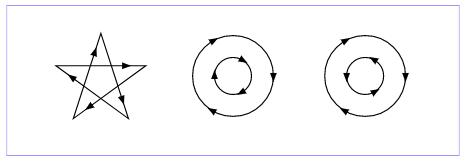

非零环绕填充方式如下

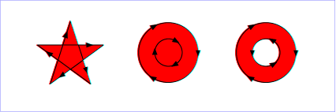

奇偶环绕填充方式如下

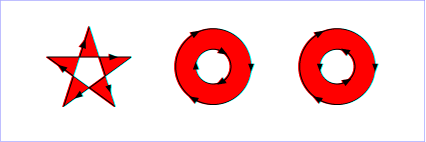

### 绘制线段

```javascript
function draw(){
    let canvas = document.getElementById('test');
    if (!canvas.getContext) return;
    let ctx = canvas.getContext("2d");
    ctx.beginPath(); // 新建一条path
    ctx.moveTo(50, 50); // 把画笔移动到指定的坐标
    ctx.lineTo(200, 50); // 绘制一条从当前位置到指定坐标(200, 50)的直线.
    ctx.closePath(); // 闭合路径。会拉一条从当前点到path起始点的直线。如果当前点与起始点重合，则什么都不做
    ctx.stroke(); //绘制路径。
}
draw();
```

### 绘制三角形边框

```javascript
function draw(){
    let canvas = document.getElementById('test');
    if (!canvas.getContext) return;
    let ctx = canvas.getContext("2d");
    ctx.beginPath(); // 新建一条path
    ctx.moveTo(50, 50); // 把画笔移动到指定的坐标
    ctx.lineTo(100,100); // 先从(50,50)移动到(100,100)
    ctx.lineTo(30,80); // 再从(100,100)移动到(30,80)
    ctx.closePath(); // 虽然我们只绘制了两条线段，但是closePath()会closePath，绘制出一条从(30,80)到(50, 50)的线段，closePath后仍然是一个3角形
    ctx.stroke(); // 绘制路径。如果只执行stroke()不会自动closePath()
}
```

没有执行`closePath()`，线段没有闭合


执行了`closePath()`，线段闭合，成为三角形


### 填充三角形

```javascript
function draw(){
    let canvas = document.getElementById('test');
    if (!canvas.getContext) return;
    let ctx = canvas.getContext("2d");
    ctx.beginPath(); // 新建一条path
    ctx.moveTo(50, 50); // 把画笔移动到指定的坐标
    ctx.lineTo(100,100); // 先从(50,50)移动到(100,100)
    ctx.lineTo(30,80); // 再从(100,100)移动到(30,80)
    ctx.closePath(); // 虽然我们只绘制了两条线段，但是closePath()会closePath，绘制出一条从(30,80)到(50, 50)的线段，closePath后仍然是一个3角形
    ctx.fill(); // 填充闭合区域。与stroke()不同的是，如果path没有闭合，则fill()会自动闭合路径。
}
```


### 绘制圆弧

有两个方法可以绘制圆弧：

1、`arc(x, y, r, startAngle, endAngle, anticlockwise)`: 以`(x, y)` 为圆心，以`r` 为半径，从 `startAngle` 弧度开始到`endAngle`弧度结束。`anticlosewise` 是布尔值，`true` 表示逆时针，`false` 表示顺时针(默认是顺时针)。

**注意：**

- 这里的度数都是弧度。
- `0` 弧度是指的 `x` 轴正方向。

```javascript
radians=(Math.PI/180)*degrees   //角度转换成弧度
```

```javascript
function draw(){
    let canvas = document.getElementById('test');
    if (!canvas.getContext) return;
    let ctx = canvas.getContext("2d");
    ctx.beginPath(); // 新建一条path
    ctx.arc(50, 50, 40, 0, Math.PI / 2, false); // Math.PI = 180°
    ctx.stroke(); // // 绘制路径 圆弧两端不会闭合
 
    ctx.beginPath();
    ctx.arc(150, 50, 40, 0, -Math.PI / 2, true);
    ctx.closePath();
    ctx.stroke(); // 执行了closePath() 圆弧两端会闭合
 
    ctx.beginPath();
    ctx.arc(50, 150, 40, -Math.PI / 2, Math.PI / 2, false);
    ctx.fill(); // 填充
 
    ctx.beginPath();
    ctx.arc(150, 150, 40, 0, Math.PI, false);
    ctx.fill();
 
}
draw();
```


2、`arcTo(x1, y1, x2, y2, radius)`: 根据给定的控制点和半径画一段圆弧，最后再以直线连接两个控制点。

```javascript
function draw(){
    let canvas = document.getElementById('test');
    if (!canvas.getContext) return;
    let ctx = canvas.getContext("2d");
    ctx.beginPath();
    ctx.moveTo(50, 50);
       // 参数x1,y1：控制点1坐标   参数x2,y2：控制点2坐标  参数radius：圆弧半径
    ctx.arcTo(200, 50, 200, 200, 100);
    ctx.lineTo(200, 200)
    ctx.stroke();
    // 绘制控制点
    ctx.beginPath();
    ctx.rect(50, 50, 10, 10);
    ctx.rect(200, 50, 10, 10)
    ctx.rect(200, 200, 10, 10)
    ctx.fill()
}
draw();
```


`arcTo` 方法的说明：

这个方法可以理解成绘制的弧形是由两条切线所决定。

- 第 1 条切线：**起始点**和**控制点1**决定的直线。

- 第 2 条切线：**控制点1**和**控制点2**决定的直线

**其实绘制的圆弧就是与这两条直线相切的圆弧。**


### 绘制贝塞尔曲线

#### 什么是贝塞尔曲线

*贝塞尔曲线(Bézier curve)*，又称*贝兹曲线或贝济埃曲线*，是应用于二维图形应用程序的数学曲线。

一般的矢量图形软件通过它来精确画出曲线，贝兹曲线由线段与节点组成，节点是可拖动的支点，线段像可伸缩的皮筋，我们在绘图工具上看到的钢笔工具就是来做这种矢量曲线的。

贝塞尔曲线是计算机图形学中相当重要的参数曲线，在一些比较成熟的位图软件中也有贝塞尔曲线工具如 PhotoShop 等。在 Flash4 中还没有完整的曲线工具，而在 Flash5 里面已经提供出贝塞尔曲线工具。

贝塞尔曲线于 1962，由法国工程师皮埃尔·贝塞尔（Pierre Bézier）所广泛发表，他运用贝塞尔曲线来为汽车的主体进行设计。贝塞尔曲线最初由Paul de Casteljau 于 1959 年运用 de Casteljau 演算法开发，以稳定数值的方法求出贝兹曲线。

- 一次贝塞尔曲线是一条直线


- 二次贝塞尔曲线


- 三次贝塞尔曲线


#### 绘制贝塞尔曲线

##### 绘制二次贝塞尔曲线

```javascript
quadraticCurveTo(cp1x, cp1y, x, y)
```

**说明：**

-  参数 `cp1x`和 `cp1y`：**控制点**坐标
-  参数 `x` 和 `y`：**结束点**坐标

```javascript
function draw(){
    let canvas = document.getElementById('tutorial');
    if (!canvas.getContext) return;
    let ctx = canvas.getContext("2d");
    ctx.beginPath();
    ctx.moveTo(10, 200); // 起始点
    let cp1x = 40, cp1y = 100;  // 控制点
    let x = 200, y = 200; // 结束点
    // 绘制二次贝塞尔曲线
    ctx.quadraticCurveTo(cp1x, cp1y, x, y);
    ctx.stroke();
    // 绘制控制点
    ctx.beginPath();
    ctx.rect(10, 200, 10, 10);
    ctx.rect(cp1x, cp1y, 10, 10);
    ctx.rect(x, y, 10, 10);
    ctx.fill();
 
}
draw();
```


##### 绘制三次贝塞尔曲线

```javascript
bezierCurveTo(cp1x, cp1y, cp2x, cp2y, x, y)
```

**说明：**

-  参数 `cp1x` 和 `cp1y`：**控制点 1 **的坐标
-  参数 `cp2x` 和 `cp2y`：**控制点 2 **的坐标
-  参数 `x` 和 `y`：**结束点**的坐标

```javascript
function draw(){
    let canvas = document.getElementById('test');
    if (!canvas.getContext) return;
    let ctx = canvas.getContext("2d");
    ctx.beginPath();
    ctx.moveTo(40, 200); // 起始点
    let cp1x = 20, cp1y = 100;  // 控制点1
    let cp2x = 100, cp2y = 120;  // 控制点2
    let x = 200, y = 200; // 结束点
    // 绘制二次贝塞尔曲线
    ctx.bezierCurveTo(cp1x, cp1y, cp2x, cp2y, x, y);
    ctx.stroke();
 
    ctx.beginPath();
    ctx.rect(40, 200, 10, 10);
    ctx.rect(cp1x, cp1y, 10, 10);
    ctx.rect(cp2x, cp2y, 10, 10);
    ctx.rect(x, y, 10, 10);
    ctx.fill();
 
}
draw();
```


## 添加样式和颜色

如果想要给图形上色，有两个属性可以做到。

1. `fillStyle = color` 设置图形的**填充颜色**
2. `strokeStyle = color` 设置图形的**轮廓颜色**

**备注：**

- 1. color 可以是表示 `css `颜色值的字符串、渐变对象或者图案对象。
- 2. 默认情况下，线条和填充颜色都是黑色。
- 3. 一旦设置了`strokeStyle `或者`fillStyle`的值，那么这个新值就会成为新绘制的图形的默认值。如果你要给每个图形上不同的颜色，你需要重新设置 `fillStyle `或 `strokeStyle `的值。

### 填充颜色（fillStyle）

```javascript
function draw(){
  let canvas = document.getElementById('my-canvas');
  if (!canvas.getContext) return;
  let ctx = canvas.getContext("2d");
  for (let i = 0; i < 6; i++){
    for (let j = 0; j < 6; j++){
      ctx.fillStyle = 'rgb(' + Math.floor(255 - 42.5 * i) + ',' +
        Math.floor(255 - 42.5 * j) + ',0)';
      ctx.fillRect(j * 50, i * 50, 50, 50);
    }
  }
}
draw();
```


### 轮廓颜色（strokeStyle ）

```javascript
function draw(){
  let canvas = document.getElementById('my-canvas');
  if (!canvas.getContext) return;
  let ctx = canvas.getContext("2d");
  for (let i = 0; i < 6; i++){
    for (let j = 0; j < 6; j++){
      ctx.strokeStyle = 'rgb(' + Math.floor(255 - 42.5 * i) + ',' +
        Math.floor(255 - 42.5 * j) + ',0)';
      ctx.strokeRect(j * 50, i * 50, 50, 50);
    }
  }
}
draw();
```


### 透明度

`globalAlpha = Number` 这个属性影响到 canvas 里**所有图形**的透明度，有效的值范围是 0.0 （完全透明）到 1.0（完全不透明），默认是 1.0。

 `globalAlpha`属性在需要绘制大量拥有相同透明度的图形时候相当高效。一般情况下使用`rgba()`设置透明度更加好一些。

### 线条样式（lineStyle）

#### 线宽（lineWidth ）

线宽。只能是正值。默认是 1.0。

起始点和终点的连线为中心，**上下各占线宽的一半**。

```javascript
function draw(){
  let canvas = document.getElementById('my-canvas');
  if (!canvas.getContext) return;
  let ctx = canvas.getContext("2d");
 ctx.beginPath()
 ctx.moveTo(0,0)
 ctx.lineTo(300,300)
 ctx.lineWidth=10
 ctx.closePath()
 ctx.stroke()
}
draw();
```

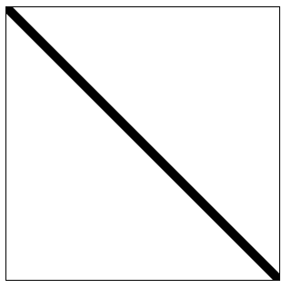

#### 线条末端样式（lineCap）

`lineCap=type`，`type`总共有三个值：

1. `butt`：线段末端以方形结束
2. `round`：线段末端以圆形结束
3. `square`：线段末端以方形结束，但是增加了一个宽度和线段相同，高度是线段宽度一半的矩形区域。

```javascript
function draw() {
    let canvas = document.getElementById('my-canvas');
    if (!canvas.getContext) return;
    let ctx = canvas.getContext("2d");
    let lineCaps = ["butt", "round", "square"];
    for (let i = 0; i < 3; i++) {
        ctx.beginPath();
        ctx.moveTo(20 + 30 * i, 30);
        ctx.lineTo(20 + 30 * i, 100);
        ctx.lineWidth = 20;
        ctx.lineCap = lineCaps[i];
        ctx.stroke();
    }
    // 绘制基准线
    ctx.beginPath();
    ctx.moveTo(0, 30);
    ctx.lineTo(300, 30);

    ctx.moveTo(0, 100);
    ctx.lineTo(300, 100)

    ctx.strokeStyle = "red";
    ctx.lineWidth = 1;
    ctx.stroke();
}
draw();
```


#### 线条间接合处的样式（lineJoin ）

同一个 path 内，设定线条与线条间接合处的样式。`lineJoin =type`，`type`总共有三个值：

1. `round` 通过填充一个额外的，圆心在相连部分末端的扇形，绘制拐角的形状。 圆角的半径是线段的宽度。
2. `bevel` 在相连部分的末端填充一个额外的以三角形为底的区域， 每个部分都有各自独立的矩形拐角。
3. `miter`(默认) 通过延伸相连部分的外边缘，使其相交于一点，形成一个额外的菱形区域。

```javascript
function draw() {
    let canvas = document.getElementById('my-canvas');
    if (!canvas.getContext) return;
    let ctx = canvas.getContext("2d");

    let lineJoins = ['round', 'bevel', 'miter'];
    ctx.lineWidth = 20;

    for (let i = 0; i < lineJoins.length; i++) {
        ctx.lineJoin = lineJoins[i];
        ctx.beginPath();
        ctx.moveTo(50, 50 + i * 50);
        ctx.lineTo(100, 100 + i * 50);
        ctx.lineTo(150, 50 + i * 50);
        ctx.lineTo(200, 100 + i * 50);
        ctx.lineTo(250, 50 + i * 50);
        ctx.stroke();
    }
}
draw();
```


#### 虚线

用 `setLineDash()` 方法和 `lineDashOffset = Number` 属性来制定虚线样式。

- `setLineDash([Number,Number])` 方法接受一个数组，来指定线段与间隙的交替；
- `lineDashOffset = Number`属性设置起始偏移量。

```javascript
function draw() {
    let canvas = document.getElementById('my-canvas');
    if (!canvas.getContext) return;
    let ctx = canvas.getContext("2d");
    ctx.beginPath()
    ctx.setLineDash([10,5]) // [实线长度, 间隙长度]
    ctx.lineDashOffset=0
    ctx.strokeRect(50,50,100,100)
}
draw(); 
```


**备注：**

`getLineDash() `返回一个包含当前虚线样式，长度为非负偶数的数组。

```javascript
console.log('getLineDash',ctx.getLineDash()); // ==> getLineDash (2) [10, 5]
```


## 绘制文本

### 绘制文本的两个方式

1. **canvas 提供了两种方法来渲染文本:**

2. 1. `fillText(text, x, y [, maxWidth])` 在指定的 (x,y) 位置填充指定的文本，绘制的最大宽度是可选的。
   2. `strokeText(text, x, y [, maxWidth])` 在指定的 (x,y) 位置绘制文本边框，绘制的最大宽度是可选的。

```javascript
function draw() {
    let canvas = document.getElementById('my-canvas');
    if (!canvas.getContext) return;
    let ctx = canvas.getContext("2d");
    ctx.font= "50px sans-serif"
    ctx.direction ='ltr'
    ctx.fillText('CANVAS',50,50)
    ctx.strokeText('CANVAS',50,150)
}
draw(); 
```

### 给文本添加样式

1. `font = value` 当前我们用来绘制文本的样式。这个字符串使用和 `CSS font` 属性相同的语法。 默认的字体是 `10px sans-serif`。
2. `textAlign = value` 文本对齐选项。 可选的值包括：`start`, `end`, `left`, `right` or `center`。 默认值是 `start`。
3. `textBaseline = value` 基线对齐选项，可选的值包括：`top`, `hanging`, `middle`, `alphabetic`, `ideographic`, `bottom`。默认值是 `alphabetic。`。
4. `direction = value` 文本方向。可能的值包括：`ltr`, `rtl`, `inherit`。默认值是 `inherit`。


## 绘制图片（drawImage）

### 由零开始创建图片

```javascript
let img = new Image();   // 创建一个元素
img.src = 'myImage.png'; // 设置图片源地址
// 参数 1：要绘制的 img  
// 参数 2、3：绘制的 img 在 canvas 中的坐标
ctx.drawImage(img,0,0); 
```

**注意：** 考虑到图片是从网络加载，如果 `drawImage` 的时候图片还没有完全加载完成，则什么都不做，个别浏览器会抛异常。所以我们应该保证在 `img` 绘制完成之后再 `drawImage`。

```javascript
let img = new Image();   // 创建img元素
img.onload = function(){
    ctx.drawImage(img, 0, 0)
}
img.src = 'myImage.png'; // 设置图片源地址
```


### 绘制`img`标签元素中的图片

```html

<canvas id="my-canvas" width="300" height="300"></canvas>
```

```javascript
function draw() {
    let canvas = document.getElementById('my-canvas');
    if (!canvas.getContext) return;
    let ctx = canvas.getContext("2d");
    let img = document.querySelector("img");
    ctx.drawImage(img, 0, 0);
}
document.querySelector("img").onclick = function () {
    draw();
}
```


### 缩放图片

`drawImage()` 也可以再添加两个参数：

```javascript
drawImage(image, x, y, width, height)
```

这两个参数用来控制 当`canvas `画入时应该缩放的大小。

```javascript
function draw() {
    let canvas = document.getElementById('my-canvas');
    if (!canvas.getContext) return;
    let ctx = canvas.getContext("2d");
    let img = new Image();   // 创建img元素
	img.onload = function(){
    ctx.drawImage(img, 0, 0,300,300)
	}
	img.src = 'myImage.png'; // 设置图片源地址
}
draw();

```


### 切片

```javascript
drawImage(image, sx, sy, sWidth, sHeight, dx, dy, dWidth, dHeight)
```

第一个参数和其它的是相同的，都是一个图像或者另一个 canvas 的引用

其余8个参数：前 4 个是定义**图像源**的切片位置和大小，后 4 个则是定义**切片**的目标显示位置和大小

**注意：**

- `sx`，`sy`都是基于原始图片的位置，并不是基于`canvas`
- `dx`，`dx`是基于`canvas`的位置


## 状态的保存和恢复

`Saving and restoring state` 是绘制复杂图形时必不可少的操作。

`save()` 和 `restore()` 方法是用来保存和恢复 `canvas` 状态的，都没有参数。

`Canvas` 的状态就是当前画面应用的所有样式和变形的一个快照。

### `save()`

`Canvas`状态存储在栈中，每当`save()`方法被调用后，当前的状态就被推送到栈中保存。

**一个绘画的状态包括：**

- 当前应用的变形（即移动，旋转和缩放）
- `strokeStyle`, `fillStyle`, `globalAlpha`, `lineWidth`, `lineCap`, `lineJoin`, `miterLimit`, `shadowOffsetX`, `shadowOffsetY`, `shadowBlur`, `shadowColor`, `globalCompositeOperation 的值`
- 当前的裁切路径（`clipping path`）

可以调用任意多次 `save`方法，类似数组的 `push()`。

> 当我们对画布进行旋转，缩放，平移等操作的时候其实我们是想对特定的元素进行操作，比如图片，一个矩形等，但是当你用`canvas`的方法来进行这些操作的时候，其实是对整个画布进行了操作，那么之后在画布上的元素都会受到影响，所以我们在操作之前调用`canvas.save()`来保存画布当前的状态，当操作之后取出之前保存过的状态，这样就不会对其他的元素进行影响

### `restore()`

每一次调用 `restore()`方法，上一个保存的状态就从栈中弹出，所有设定都恢复，类似数组的 `pop()`。

```javascript
    function draw() {
        let canvas = document.getElementById('my-canvas');
        if (!canvas.getContext) return;
        let ctx = canvas.getContext("2d");
        ctx.fillRect(0,0,300,300)
        ctx.save() // 保存默认的颜色配置 #000000
        ctx.fillStyle="pink";
        ctx.fillRect(50,50,200,200)
        ctx.restore() // 这一步从栈中取出了之前保存的默认配置 fillStyle="#000000" 
        ctx.fillRect(100,100,100,100)
    }
    draw();
```


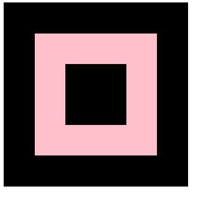

## 变形

### `translate(x,y)`

`translate(x,y)`用来移动`canvas`的**原点**到指定位置，`translate`方法接收两个参数：

1. `x`是左右偏移量
2. `y`是上下偏移量


**注意：** `translate`移动的是`canvas`的坐标原点，相当与整个`canvas`坐标变换

```javascript
    function draw() {
        let canvas = document.getElementById('my-canvas');
        if (!canvas.getContext) return;
        let ctx = canvas.getContext("2d");
        ctx.save() // 保存坐标变换之前的状态
        ctx.translate(50,50) // 移动canvas坐标原点
        ctx.fillRect(50,50,200,200)

        ctx.restore() // 恢复已保存在栈中的初始状态坐标位置
        ctx.strokeStyle='pink'
        ctx.strokeRect(50,50,200,200)
    }
    draw();
```

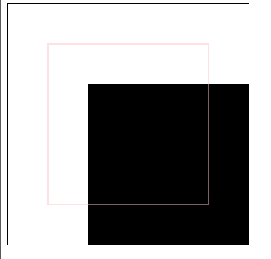

### `rotate(angle)`

`rotate(angle)`，旋转坐标轴。

这个方法只接收一个参数：旋转的角度（angle),它是顺时针方向，以**弧度**为单位的值，旋转的中心是`canvas`坐标原点。

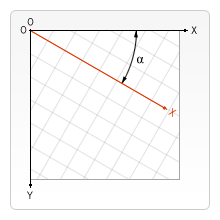

```javascript
    function draw() {
        let canvas = document.getElementById('my-canvas');
        if (!canvas.getContext) return;
        let ctx = canvas.getContext("2d");
        ctx.save() // 保存坐标角度变换之前的状态
        ctx.rotate(Math.PI/180*30) // rotate接收参数是弧度
        ctx.fillRect(100,100,50,50)
        ctx.restore() // 取出从栈中保存的初始化状态 
        ctx.fillRect(100,100,50,50)
    }
    draw();
```

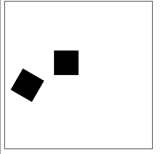


### `scale(x, y)`

`scale(x, y)`，用它来增减图形在 `canvas` 中的像素数目，对形状，位图进行缩小或者放大。

`scale`方法接受两个参数：`x`,`y` 分别是横轴和纵轴的缩放因子，它们都必须是正值。值比`1.0`小表示缩小，比`1.0`大则表示放大，值为`1.0`时什么效果都没有。

默认情况下，`canvas` 的`1`单位就是`1`个像素。举例说，如果我们设置缩放因子是`0.5`，`1`个单位就变成对应`0.5`个像素，这样绘制出来的形状就会是原先的一半。同理，设置为`2.0`时`1`个单位就对应变成了`2`像素，绘制的结果就是图形放大了`2`倍。

```javascript
    function draw() {
        let canvas = document.getElementById('my-canvas');
        if (!canvas.getContext) return;
        let ctx = canvas.getContext("2d");
        ctx.fillRect(0,0,100,100)
        ctx.scale(0.5,0.5) // 缩小到原来的一半
        ctx.fillStyle='pink'
        ctx.fillRect(0,0,100,100)
    }
    draw();
```

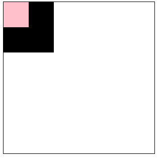

### `transform`

`transform(a,b,c,d,e,f)`，变形矩阵，就是将平移 `translate`，缩放`scale`，旋转`rotate`等几种几何变换合为一体，使用矩阵来操作多种几何变换。

**注意：** `canvas`中的变形`transform`针对的不是绘制的图形，而是针对画布本身。

**参数说明**

- `a`水平缩放
- `b`水平倾斜
- `c`垂直倾斜
- `d`垂直缩放
- `e`水平移动
- `f`垂直移动

我们把它们放在一个**矩阵**里，就像下面这样：


**矩阵的唯一作用就是简化多种几何变换之后新的坐标的计算方式**

```javascript
    function draw() {
        let canvas = document.getElementById('my-canvas');
        if (!canvas.getContext) return;
        let ctx = canvas.getContext("2d");
        ctx.fillStyle="orange";
        ctx.fillRect(50,50,100,50);
        ctx.transform(1,1,0,1,0,0);
        ctx.fillStyle="green";
        ctx.fillRect(50,50,100,50);
    }
    draw();
```

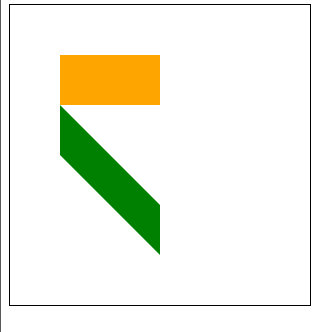

## 合成`globalCompositeOperation`

想要实现 `Photoshop` 中 `合并图像` 的操作，`Canvas` 提供了属性 `globalCompositeOperation` 用来设置图片混排模式

- **图片混排模式**
  混排模式可以简单的理解为两个图层按照不同模式，可以组合成不同的结果显示出来，混排模式会用到两个图层：先绘制的图是**目标图(DST)** ，后绘制的图是**源图(SRC)**

`canvas` 提供了 26 种图片混排模式

```javascript
source-over
source-in
source-out
source-atop
destination-over
destination-in
destination-out
destination-atop 
lighter
copy 
xor 
multiply 
screen 
overlay 
darken 
lighten
color-dodge
color-burn 
hard-light 
soft-light 
difference 
exclusion 
hue 
saturation
color
luminosity
```

- `Canvas globalCompositeOperation` 属性

  `ctx.globalCompositeOperation` 属性用于设定绘制新图形时采用的图形混排模式，它的值必须是上面 `26` 种之一

**语法**

```javascript
ctx.globalCompositeOperation = type;
```

### `source-over`

> 这是默认设置，新图像会覆盖在原有图像

```javascript
    function draw() {
        let canvas = document.getElementById('my-canvas');
        if (!canvas.getContext) return;
        let ctx = canvas.getContext("2d");

        ctx.fillStyle = "blue";
        ctx.fillRect(0, 0, 200, 200);
        ctx.globalCompositeOperation = "source-over"; //全局合成操作
        ctx.fillStyle = "red";
        ctx.fillRect(100, 100, 200, 200);
    }
    draw();
```

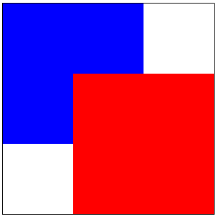

### `source-in`

>仅仅会出现新图像与原来图像重叠的部分，其他区域都变成透明的。(包括其他的老图像区域也会透明)

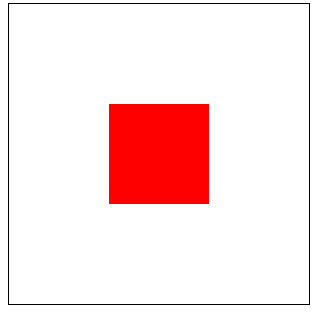

### `source-out`

>仅仅显示新图像与老图像没有重叠的部分，其余部分全部透明。(老图像也不显示)

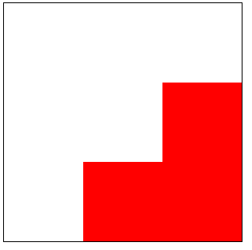

### `source-atop`

> 新图像仅仅显示与老图像重叠区域。老图像仍然可以显示，新图像在上

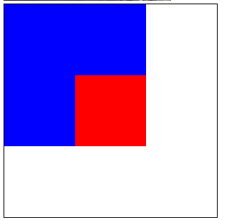

### `destination-over`

> 新图像会在老图像下面


### `destination-in`

> 仅仅新老图像重叠部分的老图像被显示，其他区域全部透明

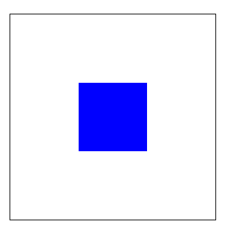

### `destination-out`

> 仅仅老图像与新图像没有重叠的部分

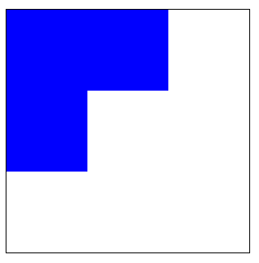

### `destination-atop`

> 老图像仅仅仅仅显示重叠部分，新图像会显示在老图像的下面。

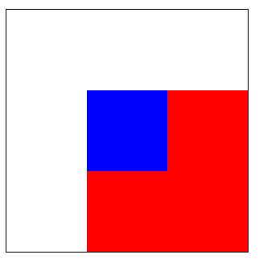

### `lighter`

> 新老图像都显示，但是重叠区域的颜色做加处理。

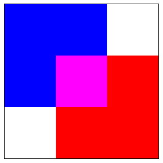

### `copy`

> 只有新图像会被保留，其余的全部被清除(透明)。

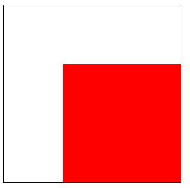

### `xor`

> 重叠部分会变成透明。

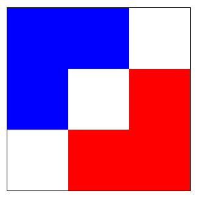

### `multiply`

> 顶层的像素和相应的底层的像素相乘。图片会变暗

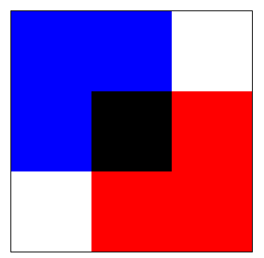

### `screen`

> 像素会被反转，相乘，然后再反转。返回的图片会变亮（和multiply相反）

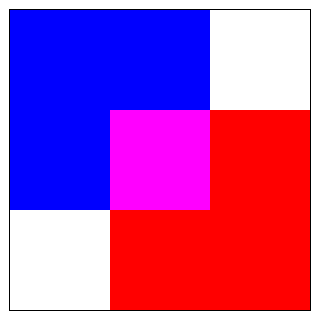

### `overlay`

> `multiply` 和 `screen`模式的组合。暗的图层会变得更暗，亮的图层会变得更亮。

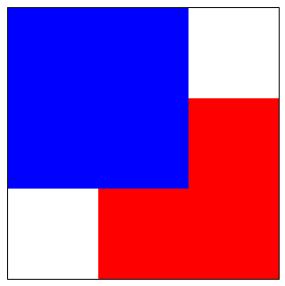

### `darken`

> 保留重叠部分最黑的像素。(每个颜色位进行比较，得到最小的)

```javascript
blue: "#0000ff"
red: "#ff0000"
```

- 所以重叠部分的颜色：`#000000`。

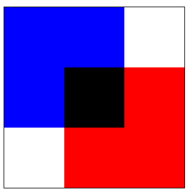

### `lighten`

> 保证重叠部分最量的像素。(每个颜色位进行比较，得到最大的)

```javascript
blue: "#0000ff"
red: "#ff0000"
```

- 所以重叠部分的颜色：`#ff00ff`。

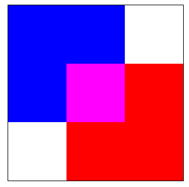

### `color-dodge`

> 通过反转的源图层来分类底部的目标图层

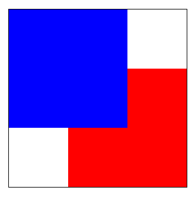

### `color-burn`

> 通过源图层来分离反转的底部图层，然后再将结果反转


### `hard-light`

> 类似multiply 和 screen的组合，但是源和目标图层交换。

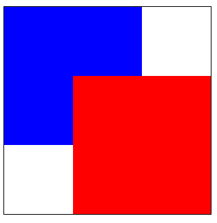

### `soft-light`

> 柔光模式。纯黑色或白色不会产生纯黑色或白色

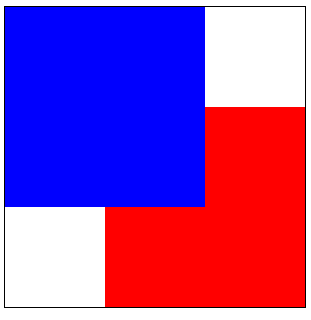

### `difference`

> 从顶层减去底层

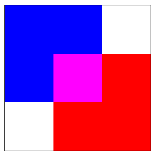

### `exclusion`

> 和difference模式相同，但是基于低对比度

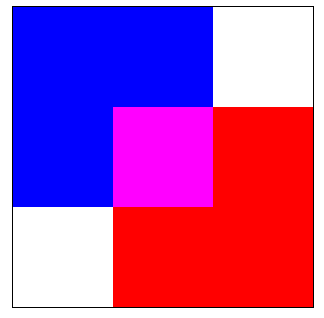

### `hue`

> 保留底层的亮度和色度，采用顶层的色调（hue）

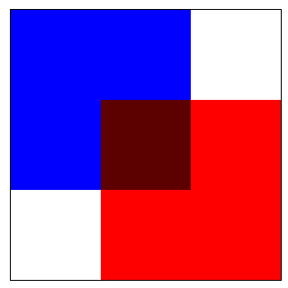

### `saturation`

> 保留底层的亮度和色度，采用顶层的色度(chroma )。

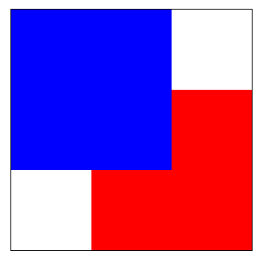

### `color`

>  保留底层的亮度和色度，采用顶层的色调(hue)和色度(chroma )

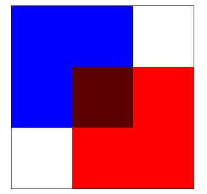

### `luminosity`

> 保留底层的亮度和色度，采用顶层的亮度

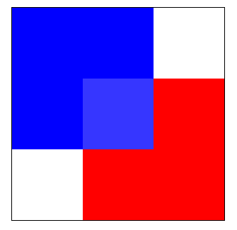


## 图像剪裁

剪裁用于隐藏我们不想看到的图形，和`ps`中不一样的是，`ps`剪裁的是图像本身，而`canvas`剪裁的是画布

`canvas`中的剪裁只有一种方法，就是根据路径来剪裁

### `clip`

`clip()` 方法将当前路径设置为剪切路径

```javascript
ctx.clip();
ctx.clip(fillRule);
ctx.clip(path, fillRule);
```

**参数：**

- `fillRule` 

> 一种算法，决定点是在路径内还是在路径外，允许的值：
> `nonzero`: 非零环绕规则， 默认的规则
> `evenodd`: 奇偶环绕规则

- `path`

> 可选，需要填充的 `Path2D` 路径

默认情况下，`canvas` 有一个与它自身一样大的裁切路径（也就是没有裁切效果）

如果`globalCompositeOperation` 属性作一比较，它可以实现与 `source-in` 和 `source-atop` 差不多的效果

最重要的区别是裁切路径不会在` canvas`上绘制东西，而且它永远不受新图形的影响

这些特性使得它在特定区域里绘制图形时相当好用

```javascript
    function draw() {
        let canvas = document.getElementById('my-canvas');
        if (!canvas.getContext) return;
        let ctx = canvas.getContext("2d");
        ctx.arc(100, 100, 75, 0, Math.PI * 2, false);
        ctx.clip(); // 将画布裁剪成一个圆
        ctx.fillRect(0, 0, 100, 100); // 裁剪后绘制的图形都不会超出画布外
        ctx.fillStyle = "green";
        ctx.fillRect(100, 100, 100, 100);
        ctx.fillStyle = "red";
        ctx.fillRect(40, 40, 30, 30);
    }
    draw();
```

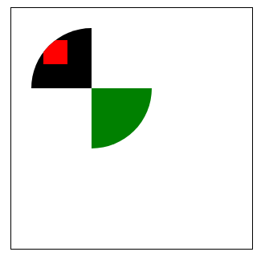

如果不需要了，那么可以在调用 `clip()` 前先调用 `save()` 保存状态，然后再使用完后调用 `restore()` 恢复状态

```javascript
    function draw() {
        let canvas = document.getElementById('my-canvas');
        if (!canvas.getContext) return;
        let ctx = canvas.getContext("2d");
        ctx.arc(100, 100, 75, 0, Math.PI * 2, false);
        ctx.save() // 保存未裁剪的状态
        ctx.clip();
        ctx.fillRect(0, 0, 100, 100);
        ctx.fillStyle = "green";
        ctx.fillRect(100, 100, 100, 100);
        ctx.restore() // 恢复初始状态
        ctx.fillStyle = "red";
        ctx.fillRect(40, 40, 30, 30);
    }
    draw();
```

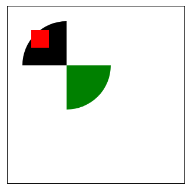


----


## 画布本身的像素能力

### `imageData`

`imageData` 对象中存储着 `canvas` 对象真实的像素数据

`imageData`对象包含以下**属性：**

- `imageData.data`

  > 只读，`Uint8ClampedArray` 类型的一维数组，包含着 `RGBA` 格式的整型数据，范围在 `0` 至 `255` 之间（ 包括 255 ）顺序的数据，

- `imageData.height`

> 只读，无符号长整型（unsigned long），图片高度，单位是像素

- `imageData.width`

>  只读，无符号长整型（unsigned long），图片宽度，单位是像素


**`Uint8ClampedArray`**

`Uint8ClampedArray` 是一个 `高度 × 宽度 × 4 bytes` 的一维数组

我们把图片看作是一个矩形，如果我们以 1 像素为单位给它绘制一个网格，下面这样	

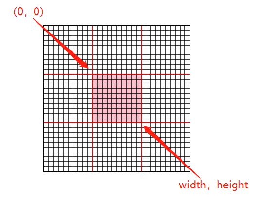

一共有`width*height`个像素块，每一个像素格子都有自己的颜色，那么总共就有 `width * height` 个颜色了

颜色的存储有 3 字节表示法 ( `RGB` ) 和 四字节表示法 ( `RGBA` ) ，`canvas` 使用的是 `RGBA`存储一个颜色值，也即是一个颜色需要 4 字节来存储

所以，那么 `canvas` 中存储一个张 `width * height` 的图片就需要 `高度 * 宽度 * 4 bytes` 字节了

既然知道了 `Uint8ClampedArray` 是一个 `高度 * 宽度 * 4 bytes` 的一维数组

那么它的索引值就是从 `0` 到 `(高度 * 宽度 * 4) - 1`

那么 `Uint8ClampedArray` 到底是是怎么存放每个像素的颜色呢？

很简单，首先创建一个长度为 `(高度×宽度×4)` 的字节数组，然后按照下面的公式存放第 m 行 n 列颜色(RGBA)

```javascript
R = 4 * (m-1) * (n-1) + 0
G = 4 * (m-1) * (n-1) + 1
B = 4 * (m-1) * (n-1) + 2
A = 4 * (m-1) * (n-1) + 3
```


---


### `ImageData` 构造函数

`ImageData` 对象也有一个构造函数，跟它自己同名，可以接受三个参数，使用这个构造函数就可以创建一个 `ImageData` 对象的实例

```javascript
new ImageData(array, width[, height]);
new ImageData(width, height);
```

**参数** 

- `array`

> 一个`Uint8ClampedArray`，就是一个装满了颜色的一维数组

- `width`

> `ImageData` 所表示的图像的宽度

* `height`

> `ImageData` 所表示的图像的高度

**注意：**

1.如果使用三个参数的构造方法，那么还有一个约束条件，就是必须满足 `Uint8ClampedArray` 的 `length` 值等于 `4*width*height` ，否则会报错

2.如果使用两个参数的构造方法，那么会自动创建一个 `4*width*height` 大小的一维数组，然后以 `0` 填充整个像素矩阵

3.如果传递了 `array` 参数，那么 `height` 参数可以选择不传递，如果不传递，那么它会自己计算

```javascript
height = array.length / ( width * 4 )
```

**example**

创建一个 `1 x 1` 大小的纯黑色的图像数据

```javascript
let imageData = new ImageData(1, 1);
```

结果是啥呢？

我们使用下面的代码输出看看

```javascript
console.log(new ImageData(1, 1));
```

输出结果如下

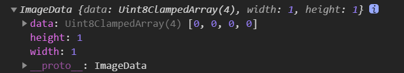


---


###  `createImageData() `创建图像数据

`ImageData` 对象除了可以使用构造方法来创建一个实例外，`Canvas` 渲染上下文还提供了方法 `createImageData()` 来创建一个它的实例

**`createImageData()` 方法**

> `ctx.createImageData()` 用于创建一个 新的、空白的、指定大小的` ImageData `对象
>
> 所有的像素在新对象中都是 **透明** 的

```javascript
ctx.createImageData(width, height);
ctx.createImageData(imagedata);
```

**参数** 

- `imagedata`

> 从现有的 `ImageData` 对象中，复制一个宽高一样的透明图像，图像自身不允许被复制

- `width`

> `ImageData` 所表示的图像的宽度

* `height`

> `ImageData` 所表示的图像的高度

**注意：**

1.`createImageData()` 创建的是透明的图像数据

2.`imagedata` 参数复制的只是图像的宽和高，数据没有复制过去，生成的是透明的图像

3.如果宽度或者高度变量值为零，会抛出此异常 `IndexSizeError`

**example**

创建一个 `1 x 1` 大小的透明的图像数据

```javascript
console.log(ctx.createImageData(1,1)); 
```

输出结果如下

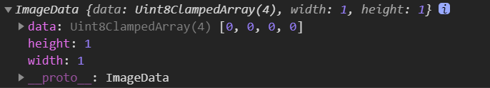


---


### `getImageData()` 获取画布图像

如果想要获取画布 ( Canvas ) 上的图像数据，可以使用 `ctx.getImageData()` 方法

**`getImageData() `方法**

`ctx.getImageData( sx , sy , sw , sh)` 用户获取画布上指定区域的图像数据

```
ImageData ctx.getImageData(sx, sy, sw, sh);
```

**参数**

- `sx`

> 要获取的矩形区域的左上角 `x` 坐标

- `sy`

> 要获取的矩形区域的左上角 `y `坐标

- `sw`

> 要获取的矩形区域的宽度

- `sh`

> 要获取的矩形区域的高度

**注意：**

1.`getImageData()`返回一个 `ImageData` 对象实例，如果传递的宽度或者高度为 0 ，那么会抛出 `IndexSizeError` 异常

2.如果获取的区域超出了画布，那么超出部分使用透明填充


**example**

```javascript
    function draw() {
        let canvas = document.getElementById('my-canvas');
        if (!canvas.getContext) return;
        let ctx = canvas.getContext("2d");
        ctx.fillStyle = "green";
        ctx.fillRect(0, 0, 10, 10);
        let imageData = ctx.getImageData(0, 0, 1, 1)
        console.log(imageData);
    }
    draw();
```

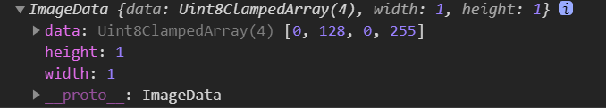

> `Uint8ClampedArray`中的`[0,128,0,255]`就是从`(0,0)`点到`(1,1)`点一个像素块的`rgba`。`rgba(0,128,0，255)`就是`ctx.fillStyle = "green";`设置的绿色。
>
> 如果获取的区域超出了画布，那么超出部分使用透明填充。因为画布本身就是透明的，如果这时候获取那么返回的图形数据就是透明色 
>
> 如果获取的区域超出了画布，那么超出部分使用透明填充


----


### `putImageData()` 绘制数据

`putImageData()`，它能将一个图像数据 `ImageData` 绘制到画布上

**`putImageData` 方法**

`ctx.putImageData()` 可以把已有的 `ImageData` 数据绘制到画布上的指定区域

**该方法不受画布转换矩阵的影响**

```javascript
ctx.putImageData(imagedata, dx, dy);

ctx.putImageData(imagedata, dx, dy, dirtyX, dirtyY, dirtyWidth, dirtyHeight);
```

**参数**

- `imageData`	

> 一个 `ImageData `实例，要绘制的图像数据

- `dx`	

> 源图像数据在目标画布中的位置偏移量（`x` 轴方向的偏移量）

- `dy`	

> 源图像数据在目标画布中的位置偏移量（`y` 轴方向的偏移量）

- `dirtyX`

> 可选，在源图像数据中，矩形区域左上角的位置。默认是整个图像数据的左上角（`x `坐标）

- `dirtyY`

> 可选，在源图像数据中，矩形区域左上角的位置。默认是整个图像数据的左上角（`y` 坐标）

- `dirtyWidth`

> 可选，在源图像数据中，矩形区域的宽度。默认是图像数据的宽度

- `dirtyHeight`	

> 可选，在源图像数据中，矩形区域的高度。默认是图像数据的高度

**这么多参数总结起来就两句话**

> 1.要么把图像数据全部绘制到画布的指定位置
>
> 2.要么把图像数据的指定区域绘制到画布的指定位置

**注意：**

1. 如果任何一个参数设置成无穷大，则会抛出此错误 `NotSupportedError`
2. 如果 imageData 不是一个完整的图像数据，会抛出错误 `InvalidStateError`

```javascript
    function draw() {
        let canvas = document.getElementById('my-canvas');
        if (!canvas.getContext) return;
        let ctx = canvas.getContext("2d");
        ctx.fillStyle = "green";
        ctx.fillRect(0, 0, 10, 10);
        let tempImageData = ctx.getImageData(0, 0, 10, 10) // 获取imageData对象实例
        console.log(tempImageData);
        ctx.putImageData(tempImageData, 200, 200) // 用获取到的imageData绘制新的图形
    }
    draw();
```

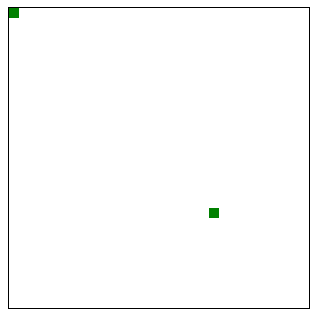

---


### 图像滤镜

