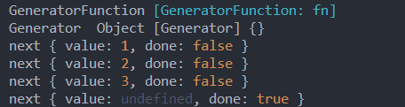
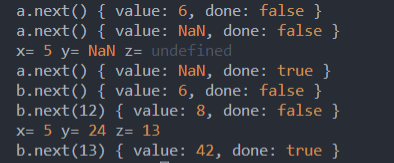

# `yield`

`yield` 关键字用来暂停和恢复一个生成器函数（([`function*`](https://developer.mozilla.org/zh-CN/docs/Web/JavaScript/Reference/Statements/function*) 或[遗留的生成器函数](https://developer.mozilla.org/zh-CN/docs/Web/JavaScript/Reference/Statements/Legacy_generator_function)）。

## 语法

```javascript
[rv] = yield [expression];
```

- `expression`

  定义通过[迭代器协议](https://developer.mozilla.org/zh-CN/docs/Web/JavaScript/Reference/Iteration_protocols#iterator)从生成器函数返回的值。如果省略，则返回`undefined`。

- `rv`

  返回传递给生成器的`next()`方法的可选值，以恢复其执行。

## 描述

`yield`关键字使生成器函数执行暂停，`yield`关键字后面的表达式的值返回给生成器的调用者。它可以被认为是一个基于生成器的版本的`return`关键字。

`yield`关键字实际返回一个`IteratorResult`（迭代器）对象，它有两个属性，`value`和`done`。`value`属性是对`yield`表达式求值的结果，而`done`是`false`，表示生成器函数尚未完全完成。

一旦遇到 `yield` 表达式，生成器的代码将被暂停运行，直到生成器的 `next()` 方法被调用。每次调用生成器的`next()`方法时，生成器都会恢复执行，直到达到以下某个值：

- `yield`，导致生成器再次暂停并返回生成器的新值。 下一次调用`next()`时，在`yield`之后紧接着的语句继续执行。
- [`throw`](https://developer.mozilla.org/zh-CN/docs/Web/JavaScript/Reference/Statements/throw)用于从生成器中抛出异常。这让生成器完全停止执行，并在调用者中继续执行，正如通常情况下抛出异常一样。
- 到达生成器函数的结尾；在这种情况下，生成器的执行结束，并且`IteratorResult`给调用者返回[`undefined`](https://developer.mozilla.org/zh-CN/docs/Web/JavaScript/Reference/Global_Objects/undefined)并且`done`为`true`。
- 到达`return`语句。在这种情况下，生成器的执行结束，并将`IteratorResult`返回给调用者，其值是由`return`语句指定的，并且`done` 为`true`。

如果将参数传递给生成器的`next()`方法，则该值将成为生成器当前`yield`操作返回的值。

`yield`无法单独工作，需要配合`generator`(生成器)的其他函数，如`next()`，**在判断中调用`next()`也会消耗`next`本身的迭代，而且不是一次性消耗，而是每次判断都会消耗**

在生成器的代码路径中的`yield`运算符，以及通过将其传递给`Generator.prototype.next()`指定新的起始值的能力之间，生成器提供了强大的控制力。

## 简单例子

```javascript
function* fn(){
    let list=[1,2,3]
    for(let i=0;i<list.length;i++){
        yield list[i]
    }
}
console.log('GeneratorFunction',fn)
console.log('Generator ',fn())
let result =fn()
console.log('next',result.next());
console.log('next',result.next());
console.log('next',result.next());
console.log('next',result.next());
```




## 更深层次的理解`yield`

```javascript
function* test(x) {
    let y = 2 * (yield (x + 1))
    let z = yield (y / 3)
    console.log('x=', x, 'y=', y, 'z=', z);
    return (x + y + z)
}
let a = test(5)
console.log('a.next()',a.next());
console.log('a.next()',a.next());
console.log('a.next()',a.next());

let b=test(5)
console.log('b.next()',b.next());
console.log('b.next(12)',b.next(12));
console.log('b.next(13)',b.next(13));
```



### 分析

**next() 传参是对yield整体的传参，否则yield类似于return**

- a组

  >1.`x`恒为5，所以第一次调用传空没问题，可得到对应的第一个`yield`返回值:`yield (x + 1)`
  >
  >2.第二次调用，无参数传入，所以`y`为`NaN(2* undefined)`，自然得不到`z`
  >
  >3.第三次调用同上分析

- b组

  > 1.`x`恒为5，所以第一次调用传空没问题，可得到对应的第一个`yield`返回值:`yield (x + 1)`
  >
  > 2.第二次调用，传入12，所以`y`为24，`(yield (x + 1)=12)`，得到第二个`yield`: `yield (y / 3)=8`
  >
  > 3.第三次调用同上分析,得到最后的`z`值并`return=42`

- 总结

  > 当`yield`在赋值表达式的右边，比如 `var result = yield 4` ,记住这句话，yield语句本身没有返回值，或者说返回值是`undefined`，但是当我们调用`next(param)`传参的时候，`param`不但作为~返回对象的`value`值，它还作为上一条`yield` 的返回值，所以`result` 才会被成功赋值。

## 一些说明

- `yield`并不能直接生产值，而是产生一个等待输出的函数

- 除`IE`外，其他所有浏览器均可兼容（包括`win10` 的`Edge`）

- 某个函数包含了`yield`，意味着这个函数已经是一个`Generator`

- 如果`yield`在其他表达式中，需要用`()`单独括起来

- `yield`表达式本身没有返回值，或者说总是返回`undefined`(由`next`返回)

- `next()`可无限调用，但既定循环完成之后总是返回`undeinded`

# `yield*`

 `yield*` 表达式用于委托给另一个`generator`或可迭代对象。

## 语法

```javascript
 yield* [[expression]];
```

- expression

  返回一个可迭代对象的表达式。

## 描述

`yield*` 表达式迭代操作数，并产生它返回的每个值。

`yield*` 表达式本身的值是当迭代器关闭时返回的值（即`done`为`true`时）。

## 示例

### 委托给其他生成器

以下代码中，`g1()` `yield` 出去的每个值都会在 `g2()` 的 `next()` 方法中返回，就像那些 `yield` 语句是写在 `g2()` 里一样。

```javascript
function* g1() {
  yield 2;
  yield 3;
  yield 4;
}

function* g2() {
  yield 1;
  yield* g1();
  yield 5;
}

var iterator = g2();

console.log(iterator.next()); // { value: 1, done: false }
console.log(iterator.next()); // { value: 2, done: false }
console.log(iterator.next()); // { value: 3, done: false }
console.log(iterator.next()); // { value: 4, done: false }
console.log(iterator.next()); // { value: 5, done: false }
console.log(iterator.next()); // { value: undefined, done: true }
```

### 委托给其他可迭代对象

除了生成器对象这一种可迭代对象，`yield*` 还可以 `yield` 其它任意的可迭代对象，比如说数组、字符串、`arguments` 对象等等。

```javascript
function* g3() {
  yield* [1, 2];
  yield* "34";
  yield* arguments;
}

var iterator = g3(5, 6);

console.log(iterator.next()); // { value: 1, done: false }
console.log(iterator.next()); // { value: 2, done: false }
console.log(iterator.next()); // { value: "3", done: false }
console.log(iterator.next()); // { value: "4", done: false }
console.log(iterator.next()); // { value: 5, done: false }
console.log(iterator.next()); // { value: 6, done: false }
console.log(iterator.next()); // { value: undefined, done: true }
```

### `yield*` 表达式的值

`yield*` 是一个表达式，不是语句，所以它会有自己的值。

```javascript
function* g4() {
  yield* [1, 2, 3];
  return "foo";
}

var result;

function* g5() {
  result = yield* g4();
}

var iterator = g5();

console.log(iterator.next()); // { value: 1, done: false }
console.log(iterator.next()); // { value: 2, done: false }
console.log(iterator.next()); // { value: 3, done: false }
console.log(iterator.next()); // { value: undefined, done: true },
                              // 此时 g4() 返回了 { value: "foo", done: true }

console.log(result);          // "foo"
```

